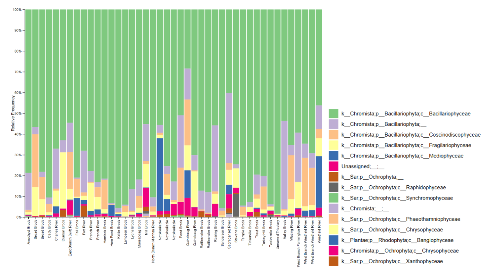
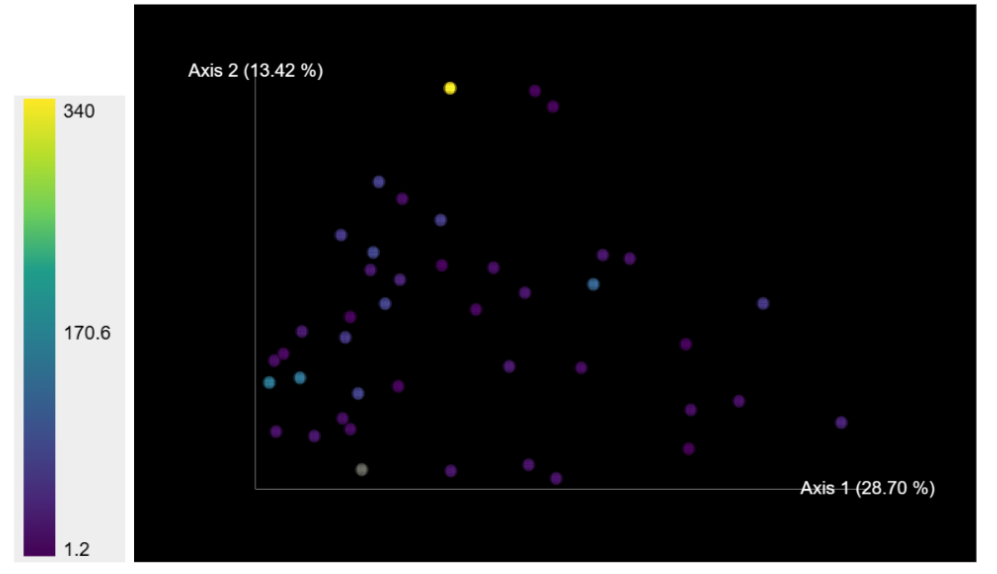

# Chloride Pollution and Diatom Diversity in Massachusetts Streams

## Authors
Caitlyn Bailey & Evan Christensen

## Background
Diatoms are a common type of eukaryotic, photoautotrophic microalgae that form the basis of many aquatic food webs. Diatoms are highly sensitive to changes in nutrients, especially nutrients associated with fertilizer and runoff (Gonzalez‐Saldias _et al._ 2026). Quantifying diatom diversity and volume opens a window into understanding how these pollutants can impact the health of streams and the health of the ecosystems in and around them (Borrego-Ramos _et al._ 2023).

According to Smucker _et al._ (2020), traditional methods to survey diatom populations are time consuming, require extensive training and knowledge of diatom physiology, and depend on accurate morphology and taxonomy. A more efficient and objective method for surveying diatoms is metabarcoding. By sequencing and analyzing the RBCL gene (a conserved sequence that codes for the enzyme rubisco, which is needed for the carbon fixation steps of photosynthesis) (Gonzalez‐Saldias _et al._ 2026), we can gain perspective on the diversity and magnitude of diatom populations without relying on morphology and light microscopy.

There are hundreds of different parameters that are used to determine stream health, ranging from pollutant concentrations to water flow rates to percent of surrounding land that is urban or used for agriculture. Chlorine concentrations in water are one of these indicators, and an important one. Chlorine enters our fresh waterways through several anthropomorphic methods, including road salt runoff in the winter and disinfectant use (Parveen _et al._ 2022). These chlorine concentrations are known to impact aquatic ecosystems.

We hope to use the data from this study, comparing stream quality and diatom diversity. We will specifically explore how chloride levels impact diatom diversity. We do this to explore how this eDNA survey method can be applied to help environmentalists and ecosystem managers assess the health of their local waterways.

## Methods
Sequences were downloaded from the class GitHub, though they originally came from Smucker _et al._ (2020); a paper entitled _DNA metabarcoding effectively quantifies diatom responses to nutrients in streams_. The files were initially in a `fastq.gz` format.

We used several programs, some loaded into a Conda environment, others not, on the UNH RON computing cluster. In order to streamline the variable and parameter setting process, and to keep these values consistent across programs, we added all the parameters to the parameters file and used a source command to add this information to each program. We ran into some issues with parameters and variables before implementing this solution, and though there was some trouble shooting, this seemed to simplify our issues.

Going through our processing pipeline, first, we used a Conda environment to run a polyG filter, which removes polyG tails and deletes reads that are rendered too short for use by trimming. We also ran an additional command to ensure that all empty files were removed. Next, we moved to cutadapt. Still in a Conda environment, this step involved a qiime tool, cutadapt. This tool looks for adapters in the sequence and removes them, or cuts them out. Afterwards, the denoise step, also done through qiime, joined paired end reads and did some quality screening. The final qiime step was to classify the sequences taxonomically based on species. At the end of this pipeline, we were left with barcode plot script to process. The new metadata file was combined with the old, to restore some information about the stream names and stream qualities. We compared the stream quality metrics to the EPA’s StreamCat database

## Findings

__Figure 1. Bar Plot__ showing taxonomic abundance by water body

Figure 1 shows varied abundance of diatom taxa based on the water body. The Bacillariophyceae class seems to be dominant in all locations except for the Quinebaug river. Up to about 9% of samples from some sites were unidentified taxa, with Mill Brook having the largest share. This could have resulted from sequences outside of the diatom group, perhaps from other microalgae, macroalgae, or aquatic plants.

__Figure 2. Weighted UniFrac principal coordinates analysis__ colored by chloride concentration.

Figure 2 shows the subtle differences chloride concentration has on diatom genetic diversity in Massachusetts streams and brooks. Diatoms within high concentrations of chloride appear to fulfil a specific niche of genetic diversity, though that niche is not exclusive to those high chloride concentration diatoms.
 
Overall, we find and literature agrees that more work needs to be done before diatom metagenomics can be used as a consistent measure of stream health. More diatom species are being discovered and categorized every year (Borrego-Ramos et al. 2023) and links between genetic variance and morphological assignment should be strengthened (Gonzalez‐Saldias et al. 2026). Though this method of barcoding shows promise (Smucker et al. 2020), more genomic information, simplified protocols, and streamlined analysis techniques should be developed before deploying this technique as an official metric of stream health.

## References
Borrego-Ramos, M., Rimet, F., Bécares, E., and Blanco, S. (2023). Environmental drivers of genetic variability in common diatom genera: Implications for shallow lake biomonitoring. Ecological Indicators _154_, 110898. https://doi.org/10.1016/j.ecolind.2023.110898.

Gonzalez‐Saldias, F., Gomà, J., Garcés‐Pastor, S., Wangensteen, O.S., Pèlachs, A., and Pérez‐Haase, A. (2026). A Comparative Analysis of DNA Metabarcoding and Morphological Identification in Diatoms Reveals Similar Patterns of Environmental Response. Ecology and Evolution _16_. https://doi.org/10.1002/ece3.72644.

Parveen, N., Chowdhury, S., and Goel, S. (2022). Environmental impacts of the widespread use of chlorine-based disinfectants during the COVID-19 pandemic. Environmental Science and Pollution Research _29_. https://doi.org/10.1007/s11356-021-18316-2.

Smucker, N.J., Pilgrim, E.M., Nietch, C.T., Darling, J.A., and Johnson, B.R. (2020). DNA metabarcoding effectively quantifies diatom responses to nutrients in streams. Ecological Applications _30_. https://doi.org/10.1002/eap.2205.

StreamCat Metrics and Definitions | US EPA (2020). US EPA. https://www.epa.gov/national-aquatic-resource-surveys/streamcat-metrics-and-definitions.

Software references in [software_references.pdf](./software_references.pdf)
